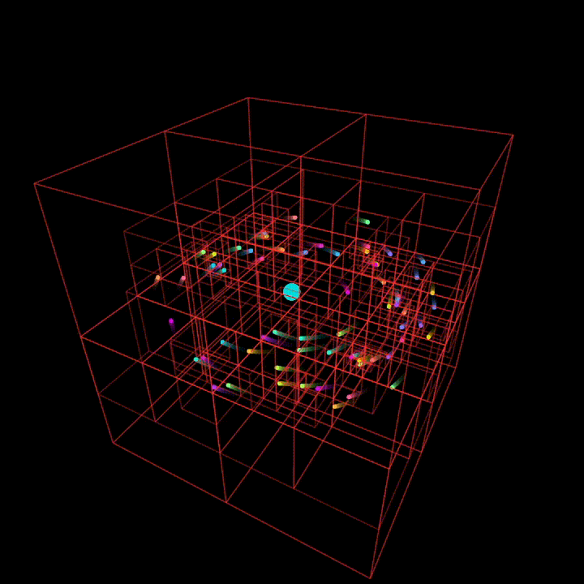
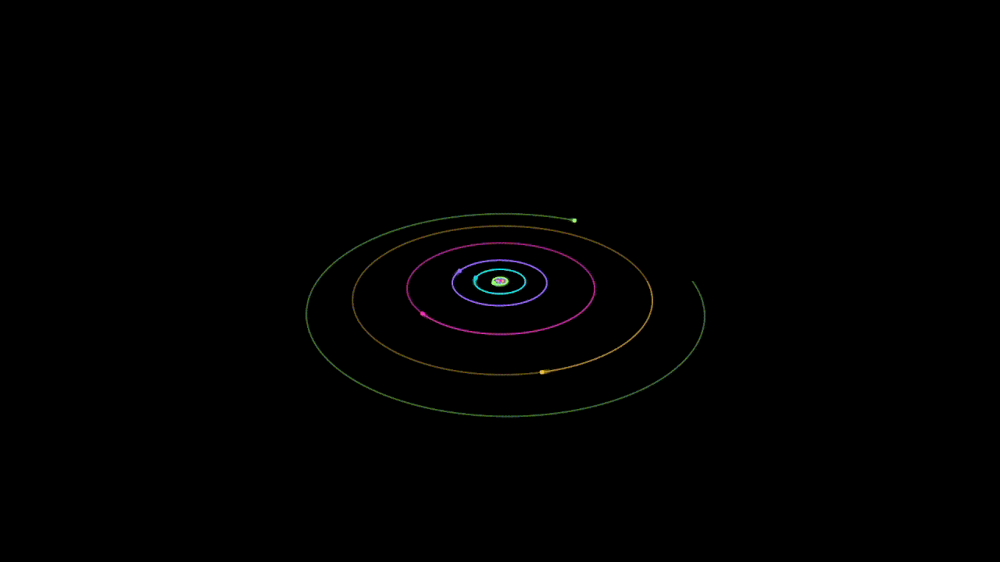
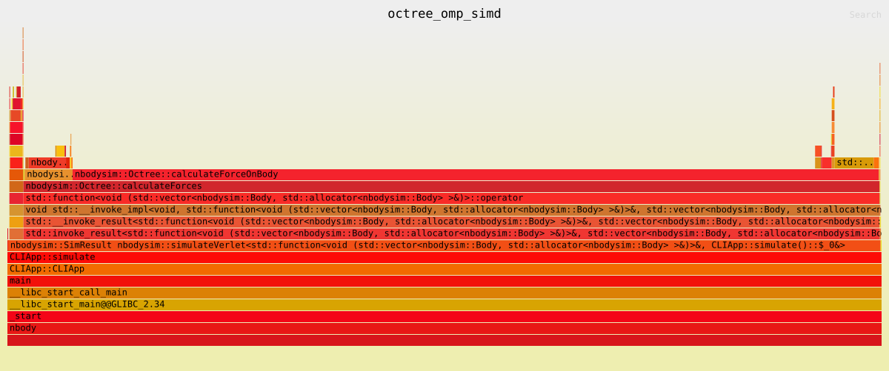
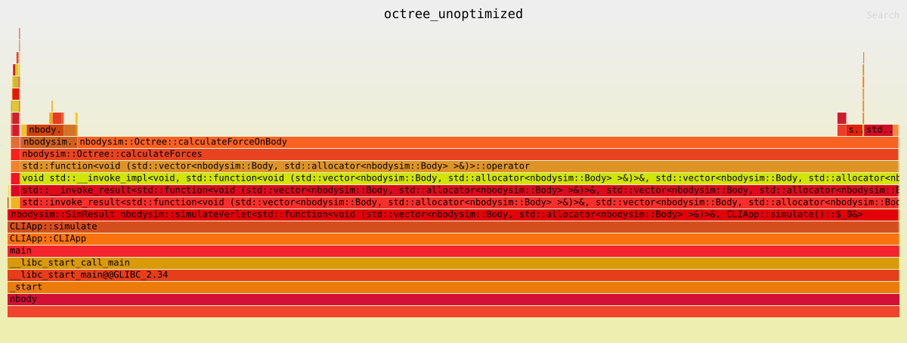
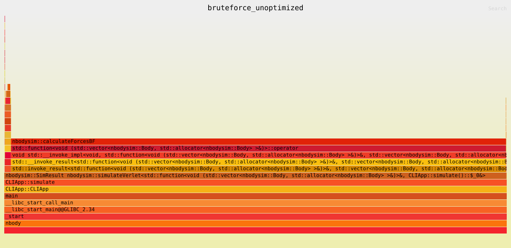

# IN1503 - Advanced Programming (Group 25)
This project is a simulation of an N-body system using Barnes-Hut algorithm for efficient computation of inverse square forces.

 

[Try it in your browser](https://shadymeowy.github.io/nbody/?viz=&msgpack_input=ring.msgpack&config=ring.toml)

## Features
- Barnes-Hut algorithm using a octree structure for efficient force calculations
- Brute-force method for comparison and validation
- Verlet velocity integration for stable time evolution
- Fallback Euler's method for validation
- CLI for easy configuration of simulation parameters
- Different scenarios including clusters, rings, and NASA J2000 data for solar system
- Energy conservation checks
- Optional momentum zeroing at initialization for drift prevention
- Configurable output intervals and progress reporting
- Visualization using OpenGL via glviskit everywhere possible (even your mobile browser!)
- msgpack and CSV output for post-processing and analysis
- Visualize your results (msgpack/CSV) without re-running the simulation

See below for **Sprint Requirements** and details for easy navigation and checking off completed tasks.

## Requirements
- Any C++20 compliant compiler
- CMake 3.10 or higher

## Building the Project
1. Clone the repository for sprint2 branch:
```bash
git clone -b sprint2 https://gitlab.lrz.de/advprog2025/25.git
# or use SSH
git clone -b sprint2 git@gitlab.lrz.de:advprog2025/25.git
cd 25
```
2. Use cmake to build and test the project:
```bash
cmake -S . -B build -DCMAKE_BUILD_TYPE=Release
cmake --build build -j8
ctest --test-dir build --output-on-failure
```

It is possible to build it to wasm via emscripten, which supports both visualization and running the simulation in browser. Takes CLI arguments via URL parameters.

## Usage

Run the simulator via the `nbody` executable produced in `./build`:

```bash
./build/nbody [options]
```

## Loading and Saving Simulations
To save csv or msgpack output, use the `--csv_output` or `--msgpack_output` options as follows:

```bash
./build/nbody --config config/j2000.toml --csv_output myresult.csv --msgpack_output myresult.msgpack --viz
```

The configuration provided in `config/` enables both outputs to `results/` folder by default.

You can load results from a msgpack file using the `--msgpack_input` option:

```bash
./build/nbody --msgpack_input results/j2000.msgpack --config config/j2000.toml --viz
```

Same as csv,

```bash
./build/nbody --csv_input results/j2000.csv --config config/j2000.toml --viz
```

When `csv_input` or `msgpack_input` is provided, the simulation will skip the computation and directly load the results for visualization. Configuration parameters will still be applied for visualization settings.

## Configuration

All simulation parameters can be set via configuration files in the `config/` folder or overridden via command line arguments. Example configuration files include:
- `config/simple.toml`: Simple test scenario with few bodies
- `config/j2000.toml`: Solar system data based on NASA J2000 epoch
- `config/ring.toml`: Ring scenario with many bodies in a ring formation
- `config/cluster.toml`: Cluster scenario with bodies in a clustered formation
- `config/octree_viz.toml`: Octree visualization demo scenario, others can also enable octree viz by setting `viz_show_octree = true`

Skipping details here, see `nbody --help` for all available options and details.

### Examples

**Solar System (J2000) with brute-force strategy:**

```bash
./build/nbody --config config/j2000.toml --viz
```

**Ring scenario with Verlet integrator (100 years, 1024 bodies, timestep 0.1 years):**

```bash
./build/nbody --config config/ring.toml --viz
```

**Cluster scenario using Barnes–Hut octree strategy:**

```bash
./build/nbody --config config/cluster.toml --viz
```

## Gallery


Try me in your browser: [Octree Visualization](https://shadymeowy.github.io/nbody/?viz=&config=octree_viz.toml&viz_show_octree=&output_interval=1e-1)


Try me in your browser: [J2000 Visualization](https://shadymeowy.github.io/nbody/?viz=&msgpack_input=j2000.msgpack&config=j2000.toml)


Try me in your browser: [Ring Visualization](https://shadymeowy.github.io/nbody/?viz=&msgpack_input=ring.msgpack&config=ring.toml)



Try me in your browser: [Simple Visualization](https://shadymeowy.github.io/nbody/?viz=&msgpack_input=simple.msgpack&config=simple.toml)

## Performance Analysis
We have implemented several optimizations including parallelization using OpenMP, vectorization using SIMD, and algorithmic optimization using Barnes-Hut. To analyze the performance impact of these optimizations, we have measured the execution time of different sections of the code using a custom timer utility. The timing information is printed when the `--debug` flag is enabled, which sets the logging level to debug and provides detailed timing information for different sections of the code.

Also we provide here sample flamegraphs generated using `flamegraph` tool for a simulation run with and without optimizations. The flamegraphs show the distribution of execution time across different functions in the code, allowing us to identify bottlenecks and the impact of our optimizations.

To generate flamegraphs, we used the following commands with different compile-time flags for enabling/disabling optimizations:
```bash
# Configure and build
cmake -S . -B build -DCMAKE_BUILD_TYPE=RelWithDebInfo -DNBODY_USE_OPENMP=ON -DNBODY_USE_SIMD=ON
cmake --build build -j8
# Generate flamegraph from perf data
flamegraph --output assets/octree_omp_simd.svg --title octree_omp_simd -- ./build/nbody --config config/perf.toml --strategy OCTREE
```

<p align="center">
  
</p>

<p align="center">
  
</p>

<p align="center">
  
</p>

## Requirements Checklist
### Sprint 1:
- [x] Generate an array of initial masses, positions, and velocities of a system of bodies in 3D space.
    - See `src/common/` and `src/scenario/`, configurable via `scenario` parameter in config files/CLI args.
- [x] Create a brute force n-body simulation O(n*n) 
    - See `src/space/brute_force.hpp`, configurable via `space` parameter in config files/CLI args.
- [x] Create a function for space-dividing an array of coordinates into an octree data structure.
    - See `src/space/octree.hpp` and `src/space/octree.cpp`.
- [x] Implement the Barnes-Hut algorithm for approximating n-body interactions using the octree.
    - See `src/space/octree.hpp`, configurable via `space` parameter in config files/CLI args.
- [x] Create a unit test, that compares the brute force reference solution with the Barnes-Hut approximation for a small test dataset.
    - See `tests/test_barnes_hut.cpp` and other tests in `tests/`.
- [x] Output a timeseries of the resulting positions of all bodies into a file 
    - See `src/integrator/sim_state.cpp` for CSV and MsgPack output functions, configurable via `csv_output` and `msgpack_output` parameters in config files/CLI args.

### Sprint 2:
- [x] Add the ability to specify parameters like the initial conditions, timestep size, simulation duration etc. in either a configuration file or as command line parameters.
    - See `src/cli/cli.cpp` and `config/` folder for configuration files, also settable via CLI args.
- [x] Create a class/datastructure that contains all the parameters (mass, position, velocity) of each body.
    - See `src/body/body.hpp` for Body class and `src/integrator/sim_state.hpp` for SimState and SimResult classes.
- [x] Add the ability to visualize the dynamics of the simulation in 3D space.
    - See `src/viz/` folder and `src/main_cli.cpp` for visualization using glviskit, configurable via `viz` and related parameters in config files/CLI args.
- [ ] Abstract the interaction function of the bodies (and add an example of how to use it)
    - **Partially** done via `src/space/space.hpp` interface, no example yet with config.
- [x] Abstract the space dividing function.
    - See `src/space/` interface, for its usage see `src/integrator/euler.hpp`, `src/integrator/verlet.hpp` and `src/integrator/yoshida.hpp`.
- [x] Clean up and refactor the code.
    - Many code improvements, and refactoring throughout the codebase. OOP principles applied to various components where sprint 1 had more functional style.

## Sprint 3:
- [x] Measure how much time is consumed during each section in the code
    - See `src/utils/timer.hpp` and its usage throughout the codebase for timing different sections. It is enabled with `--debug` flag, which sets logging level to debug and prints timing information for different sections of the code. We also provide `perf`-based flamegraphs above.
- [x] Utilize at least three different optimization techniques and study its impact on total runtime
    - Parallelization using OpenMP, vectorization using SIMD, and algorithmic optimization using Barnes-Hut are implemented. The impact of these optimizations can be measured by enabling/disabling them via compile-time flags `NBODY_USE_OPENMP` and `NBODY_USE_SIMD`. Again see flamegraphs above for performance comparison with and without these optimizations.
    - **Partial** analysis of the impact, no detailed report for different body counts and configurations yet.
- [x] At least one function should utilize vectorized instructions
    - The force calculation in `src/space/brute_force.cpp` and the velocity updates in `src/integrator/verlet.hpp`, `src/integrator/yoshida.hpp`, and `src/integrator/euler.hpp` are vectorized using SIMD, enabled with `NBODY_USE_SIMD` flag.